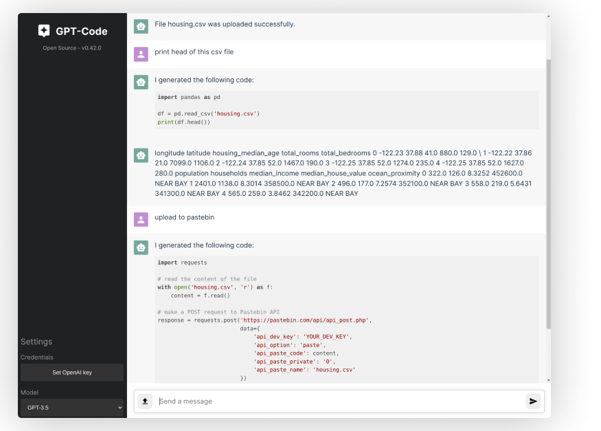

An open source implementation of OpenAI's ChatGPT [Code interpreter](https://openai.com/blog/chatgpt-plugins#code-interpreter).

Simply ask the OpenAI model to do something and it will generate & execute the code for you.

Read the [blog post](https://ricklamers.io/posts/gpt-code) to find out more.

## Installation

Open a terminal and run:

```
$ pip install gpt-code-ui
$ gptcode
```

## User interface

 
## Features
- File upload
- File download
- Context awareness (it can refer to your previous messages)
- Generate code
- Run code (Python kernel)
- Model switching (GPT-3.5 and GPT-4)

## Misc.
### Using .env for OpenAI key
You can put a .env in the working directory to load the `OPENAI_API_KEY` environment variable.

## Contributing
Please do! This should be a community initiative. I'll try my best to be responsive.
