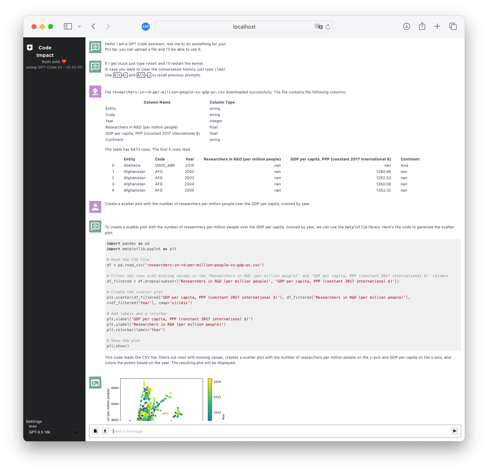

An open source implementation of OpenAI's ChatGPT [Code interpreter](https://openai.com/blog/chatgpt-plugins#code-interpreter).

Simply ask the OpenAI model to do something and it will generate & execute the code for you.

This project is an extended and further developed fork of of [Rick Lamer's GPT Code UI](https://github.com/ricklamers/gpt-code-ui).
Read the [blog post](https://ricklamers.io/posts/gpt-code) to find out more.

## User interface


## Demo Video


## Features
- File upload
- File download
- Dataset Download from Palantir Foundry using [Foundry Dev Tools](https://github.com/emdgroup/foundry-dev-tools)
- Context awareness (it can refer to your previous messages)
- Generate code
- Run code (Python kernel)
- Make proprietary code available to the model
- Model switching (GPT-3.5 and GPT-4, Bedrock, etc.)

## Using proprietary code
The model is trained on public code from GitHub. Hence, out of the box, it can only generate code that is publicly available. However, you can make your proprietary code available to the model by implementing individual functions that wrap your proprietary code. Type annotations and doc strings will help the model to understand what your code does.

### Adding a new function
Right now, proprietary functions are hard-coded to `gpt_code_ui.function_library.AVAILABLE_MODELS`. To add a new function, simply add a new entry to this dictionary. The key is the name of the function as it will be used in the prompt. The value is the function itself. The function must be a callable and can take any input and produce any output. Have a look at `gpt_code_ui.function_library.examples` for examples.

It is important that you provide type annotations and a doc string to your function to help the LLM understand what your function does and how it is used.

Considerations:
- Wrap complex code in a single function.
- Try to use simple types (e.g. `str`, `int`, `float`, `bool`, `list`, `dict`) as input and output. In the future, you can also pass complex types (e.g. `pandas.DataFrame`) but this is not yet supported.
- If you use `list` or `dict` as input, make sure to provide type annotations for the elements, e.g. `list[str]` or `dict[str, int]`.

## Misc.
### Running the Docker Container as fully packaged Service
See the [Dockerfile](Dockerfile) for details. Most notably, we do not invoke the tool directly but via [run_with_app_service_config.py](rub_with_app_service_config.py), which extracts environment variable specifications from a json-formatted `APP_SERVICE_CONFIG` environment variable.
In order to run properly, your `APP_SERVICE_CONFIG` should read similar to
```
{
  "AZURE_API_KEY": "<YOUR API KEY>",
  "AZURE_API_BASE": "<YOUR_AZURE_API_URL>",
  "AZURE_API_VERSION": "2023-09-01-preview",

  "OPENAI_API_KEY": "sk-INVALID",

  "BEDROCK_GATEWAY_API_KEY": "<YOUR API KEY>",
  "BEDROCK_GATEWAY_API_BASE": "<YOUR_BEDROCK_GATEWAY_URL>",

  "AVAILABLE_MODELS": [
    {"displayName": "GPT-3.5 16k", "name": "azure/gpt-35-turbo-16k"},
    {"displayName": "GPT-3.5 0613", "name": "azure/gpt-35-turbo-0613"},
    {"displayName": "Claude v1", "name": "bedrock_gateway/anthropic.claude-instant-v1"},
    {"displayName": "Claude v2", "name": "bedrock_gateway/anthropic.claude-v2"}
  ],

  "API_PORT": 5010,
  "WEB_PORT": 8080,

  "NO_INTERNET_AVAILABLE": 1,

  "SESSION_ENCRYPTION_KEY": "67ed8ea0-05f0-4086-9a54-6b2bb6dbcf29",

  "DEBUG": 1,
  "OPENAI_API_LOGLEVEL": "debug",

  "FOUNDRY_DATA_FOLDER": "<YOUR FOUNDRY DATA FOLDER>"
}

```

### Running locally
For local execution, your `.env` could read similar to
```
AZURE_API_KEY=XXXX
AZURE_API_BASE=https://your-resource-name.openai.azure.com
AZURE_API_VERSION=2023-09-01-preview

OPENAI_API_KEY=sk-XXXX

BEDROCK_GATEWAY_API_KEY=YYYY
BEDROCK_GATEWAY_API_BASE=https://your-gateway-url.com

AVAILABLE_MODELS=[{"displayName": "GPT-3.5 16k", "name": "azure/gpt-35-turbo-16k"}, {"displayName": "GPT-3.5 0613", "name": "azure/gpt-35-turbo-0613"}, {"displayName": "Claude v1", "name": "bedrock_gateway/anthropic.claude-instant-v1"}, {"displayName": "Claude v2", "name": "bedrock_gateway/anthropic.claude-v2"}]

API_PORT=5010
WEB_PORT=8080

SESSION_ENCRYPTION_KEY="<SECRET_KEY>"

DEBUG=1

FOUNDRY_DATA_FOLDER="<YOUR FOUNDRY DATA FOLDER>"
```
Then call
```
# build the frontend and inject it into the main application, you will need Node.js and Vite to be installed for this
make compile_frontend

# the following only required on recent MacOS, see https://stackoverflow.com/a/52230415/10984529
export OBJC_DISABLE_INITIALIZE_FORK_SAFETY=YES

# finally, run all required services
python gpt_code_ui/main.py
```
This should open a browser window, navigating you to [http://localhost:8080](http://localhost:8080), where the application is running.

### Running the AppService Container Locally with Podman
Create a file `.app_service_config.json` that contains the content of the `APP_SERVICE_CONFIG` variable.
Then simply invoke the following commands:
```
make container_image
make container_run
```
Afterwards, you should be able to access the frontend via [http://localhost:8080](http://localhost:8080).
Note, that this does not include proper foundry config at the moment. Should be fixed by someone somewhen.

### Prompt playground
Run `streamlit run gpt_code_ui/st_playground.py` to start the prompt playground app.

### Configurables
Set the `API_PORT`, `WEB_PORT` variables to override the defaults.
When `NO_INTERNET_AVAILABLE` is non-trueish or absent, the application will create dedicated virtual environments for every session and also makes active use of `!pip install ...` commands for missing packages.

## Contributing
Please contribute.


Thank you for your interest in this project!
